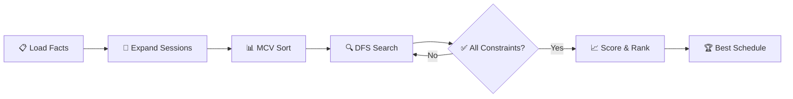

<h1 align="center">🏫 Campus Scheduler</h1>

<p align="center">
  <strong>AI-powered university timetable generator for INSAT</strong><br/>
  <em>Constraint Satisfaction · Multi-Criteria Optimization · Interactive Web Dashboard</em>
</p>

<p align="center">
  An intelligent scheduling system that generates conflict-free weekly timetables for<br/>
  <strong>INSAT</strong>, combining <strong>SWI-Prolog</strong> constraint solving with a modern <strong>Flask + JavaScript</strong> web interface.
</p>

---

## ✨ Highlights

| Feature | Description |
|---------|-------------|
| 🧠 **Prolog CSP Engine** | Recursive backtracking search with 7 hard constraints and MCV heuristic ordering |
| ⚡ **Dual Solve Modes** | Instant DFS for a quick valid schedule, or Best-of-200 sampling for optimized results |
| 📊 **Multi-Criteria Scoring** | Weighted objective balancing energy consumption, daily imbalance, and room usage fairness |
| 🌐 **Web Dashboard** | Glassmorphism dark-mode UI with interactive weekly grid, track tabs, and real-time metrics |
| 🏗️ **Realistic Model** | 18 courses, 34 sessions, 14 rooms across 3 buildings, modeled after real INSAT infrastructure |
| 🔌 **Python ↔ Prolog Bridge** | Seamless integration via `pyswip` — the browser talks JSON, the solver speaks Prolog |

---

## 📐 Architecture

```
┌──────────────────────────────────────────────────────────────────────┐
│                         Browser (Frontend)                         │
│                                                                      │
│   index.html ──── style.css (Glassmorphism Dark Theme)               │
│       │                                                              │
│       └── app.js (Fetch API · Grid Renderer · Metrics Display)       │
└──────────────────────────┬───────────────────────────────────────────┘
                           │  HTTP / JSON
                           ▼
┌──────────────────────────────────────────────────────────────────────┐
│                     Flask Server  (app.py)                          │
│                                                                      │
│   GET /                      → Serve HTML frontend                   │
│   GET /api/schedule          → Quick DFS schedule                    │
│   GET /api/schedule/optimal  → Best-of-200 optimized schedule        │
└──────────────────────────┬───────────────────────────────────────────┘
                           │  pyswip (Python ↔ Prolog FFI)
                           ▼
┌──────────────────────────────────────────────────────────────────────┐
│                    SWI-Prolog Engine                                │
│                                                                      │
│   bridge.pl ─── main.pl ─┬─ facts.pl          (Knowledge Base)       │
│                           ├─ constraints.pl    (7 Hard Constraints)   │
│                           ├─ scheduler.pl      (CSP + MCV Search)     │
│                           └─ optimization.pl   (Scoring & B&B)        │
└──────────────────────────────────────────────────────────────────────┘
```

---

## 🗂️ Project Structure

```
campus_scheduler/
│
├── facts.pl              # Knowledge base: courses, groups, rooms, buildings,
│                         #   energy costs, instructor availability, time slots
│
├── constraints.pl        # 7 hard constraint predicates (room, group, capacity,
│                         #   equipment, instructor, energy budget, same-day repeat)
│
├── scheduler.pl          # Recursive CSP engine with MCV ordering, slot sorting,
│                         #   and pre-filtered room candidates
│
├── optimization.pl       # Scoring functions (energy, imbalance, variance),
│                         #   greedy, best-of-N, and branch-and-bound strategies
│
├── main.pl               # Prolog entry point — run/0 and run_optimal/0
│                         #   with pretty-printed grouped timetables
│
├── bridge.pl             # Python ↔ Prolog bridge — flat predicates for pyswip
│                         #   with schedule caching and metric extraction
│
├── app.py                # Flask web server — REST API + frontend serving
│
├── templates/
│   └── index.html        # Main page — hero, controls, timetable grid, metrics
│
├── static/
│   ├── style.css         # Dark glassmorphism theme, animations, responsive layout
│   └── app.js            # Frontend logic — API calls, grid rendering, filters
│
└── README.md
```

---

## 🎯 How It Works

The scheduler follows a **generate-and-test** approach powered by Prolog's built-in backtracking:



### Step-by-step

1. **Load the knowledge base** — courses, rooms, buildings, instructor availability, and energy costs from `facts.pl`
2. **Expand each course** into individual sessions (e.g., a course with 2 weekly sessions becomes 2 work items)
3. **MCV ordering** — sort the work list so the most constrained courses (fewest available instructor slots) are scheduled first *(fail-first heuristic)*
4. **Recursive DFS** — for each session, try every `(room, slot)` combination, pruning branches that violate any hard constraint
5. **Score valid schedules** — compute the weighted multi-criteria objective
6. **Return the best** — either the first valid solution (quick mode) or the best among 200 sampled candidates (optimal mode)

---

## 🛡️ Constraint Model

The scheduler enforces **7 hard constraints** — any violation causes the search to backtrack:

| # | Constraint | Description |
|---|-----------|-------------|
| 1 | **No Room Conflict** | A room cannot host two sessions in the same time slot |
| 2 | **No Group Conflict** | A student group cannot attend two sessions simultaneously. Combined groups (`*_cm`) conflict with their subgroups A and B, but subgroups A and B can run in parallel |
| 3 | **Room Capacity** | The room must have enough seats for the assigned student group |
| 4 | **Equipment Match** | Room equipment must satisfy the course requirement (amphitheatre projector, IT lab, chemistry lab, biology lab, or standard) |
| 5 | **Instructor Availability** | The instructor must be available during the selected time slot |
| 6 | **Energy Budget** | The total energy consumed in a building on a given day must not exceed the building's daily limit |
| 7 | **No Same-Day Repeat** | A course cannot have two sessions scheduled on the same calendar day |

---

## 📈 Optimization

Valid schedules are ranked using a **weighted multi-criteria objective function**:

$$\text{Score} = W_1 \cdot E_{\text{total}} + W_2 \cdot I_{\text{daily}} + W_3 \cdot V_{\text{rooms}}$$

| Metric | Weight | Goal |
|--------|--------|------|
| **Total Energy** $(E)$ | 1.0 | Minimize overall energy consumption across all buildings |
| **Daily Imbalance** $(I)$ | 0.5 | Minimize the spread between the busiest and quietest day |
| **Room Variance** $(V)$ | 0.3 | Distribute sessions evenly across rooms (fairness) |

> **Lower score = better schedule.** The optimal mode samples 200 candidates and returns the one with the lowest combined score.

### Solve Strategies

| Strategy | Predicate | Speed | Quality |
|----------|-----------|-------|---------|
| **Greedy** | `greedy_schedule/2` | ⚡ Instant | First valid solution |
| **Best-of-N** | `best_of_n/3` | ⏱️ ~seconds | Best among N candidates |
| **Branch & Bound** | `optimal_schedule/1` | 🐢 Exhaustive | Globally optimal (small instances only) |

---

## 🏫 Campus Model

The knowledge base models a realistic subset of **INSAT's Year 1** curriculum:

### Departments

| Track | Full Name | Students | Courses |
|-------|-----------|----------|---------|
| **MPI** | Mathématiques, Physique, Informatique | 80 (40+40) | Algorithmique, Analyse Mathématique, Algèbre Linéaire |
| **CBA** | Chimie, Biologie Appliquées | 60 (30+30) | Chimie Générale, Biologie Cellulaire, Mathématiques |

### Session Types

| Type | Label | Setting |
|------|-------|---------|
| **CM** | Cours Magistral | Full cohort in amphitheatre |
| **TD** | Travaux Dirigés | Subgroup A or B in standard room |
| **TP** | Travaux Pratiques | Subgroup A or B in specialized lab |

### Infrastructure

| Building | Rooms | Purpose |
|----------|-------|---------|
| **Bloc A** | 2 amphitheatres + 3 TD rooms | CM lectures + MPI tutorials |
| **Bloc B** | 4 IT labs | MPI practical sessions (Algorithmique) |
| **Bloc C** | 2 chem labs + 1 bio lab + 2 TD rooms | CBA practical sessions + tutorials |

> **Total**: 14 rooms · 30 usable time slots/week (6 slots/day × 5 days, lunch excluded) · 34 weekly sessions

---

## 🚀 Getting Started

### Prerequisites

| Requirement | Version | Notes |
|-------------|---------|-------|
| [SWI-Prolog](https://www.swi-prolog.org/download/stable) | 8.x+ | Must be installed and on your system PATH |
| [Python](https://www.python.org/downloads/) | 3.10+ | Recommended |
| `Flask` | 3.x | `pip install flask` |
| `pyswip` | 0.2.x+ | `pip install pyswip` — requires SWI-Prolog to be installed |

### Installation

```bash
# Clone the repository
git clone https://github.com/your-username/campus_scheduler.git
cd campus_scheduler

# Install Python dependencies
pip install flask pyswip
```

---

## 💻 Usage

### Option 1 — Prolog CLI

Run the scheduler directly from the SWI-Prolog REPL:

```prolog
% Start SWI-Prolog
swipl

% Load the system
?- [main].

% Find the first valid schedule (instant)
?- run.

% Find the best schedule among 200 candidates
?- run_optimal.
```

Or run it as a one-liner from the terminal:

```bash
swipl -s main.pl -g run -t halt
```

### Option 2 — Web Dashboard

Launch the Flask web server:

```bash
python app.py
```

Then open your browser at:

```
http://localhost:5000
```

#### API Endpoints

| Method | Endpoint | Description |
|--------|----------|-------------|
| `GET` | `/` | Serve the interactive web dashboard |
| `GET` | `/api/schedule` | Return the first valid DFS schedule (JSON) |
| `GET` | `/api/schedule/optimal` | Return the best-of-200 optimized schedule (JSON) |

Both schedule endpoints return a JSON payload containing:

```json
{
  "mpi":     [ /* MPI track sessions */ ],
  "cba":     [ /* CBA track sessions */ ],
  "metrics": {
    "energy": 120,
    "imbalance": 18,
    "variance": 2.75,
    "score": 47.25
  },
  "elapsed": 0.34
}
```

---

## 🖥️ Example Output

### CLI Output

```
----------------------------------------------------------------------
  INSAT Timetable -- finding first valid schedule
----------------------------------------------------------------------

----------------------------------------------------------------------
  MPI (Maths-Physique-Informatique) TIMETABLE
----------------------------------------------------------------------
  | Course        | Day       | Time            | Room     |
----------------------------------------------------------------------
  | c_algo_cm s1       | Monday    | 08h00-09h30     | amphi_a1 |
  | c_analyse_cm s1    | Tuesday   | 09h45-11h15     | amphi_a1 |
  | c_algo_tp_a s1     | Tuesday   | 14h00-15h30     | it_b1    |
  ...
----------------------------------------------------------------------

----------------------------------------------------------------------
  CBA (Chimie-Biologie Appliquees) TIMETABLE
----------------------------------------------------------------------
  | Course        | Day       | Time            | Room     |
----------------------------------------------------------------------
  | c_chimie_cm s1     | Monday    | 08h00-09h30     | amphi_a2 |
  | c_bio_cm s1        | Wednesday | 14h00-15h30     | amphi_a2 |
  ...
----------------------------------------------------------------------

  Energy total   : 120 units
  Daily imbalance: 18 units
  Room variance  : 2.7500
  Combined score : 47.2500
```

---

## 🔧 Customization

### Modifying the Knowledge Base

Edit `facts.pl` to adapt the timetable to your needs:

```prolog
% Add a new course
course(c_physics_cm, g_mpi1_cm, 2, 1, amphi_proj).

% Change room capacity
room(amphi_a1, 250, amphi_proj, bloc_a).

% Adjust instructor availability
instructor_available(c_physics_cm, slot(monday, 1)).
instructor_available(c_physics_cm, slot(wednesday, 3)).

% Tune building energy budget
building(bloc_a, 250).
```

### Tuning Optimization

Edit the weights in `optimization.pl` to prioritize different objectives:

```prolog
combined_score(Schedule, Score) :-
    W1 = 1.0,   % energy total      (increase to penalize energy more)
    W2 = 0.5,   % daily imbalance   (increase to spread load more evenly)
    W3 = 0.3,   % room variance     (increase for fairer room distribution)
    ...
```

### Changing the Sample Size

In `bridge.pl`, adjust the number of candidates for the optimal mode:

```prolog
generate_optimal :-
    retractall(cached_schedule(_)),
    best_of_n(500, S, _), !,    % ← increase from 200 to 500
    assert(cached_schedule(S)).
```

---

## 🧩 Technical Details

### Search Performance

The scheduler uses several techniques to keep the search efficient:

- **MCV (Most Constrained Variable) ordering** — schedules courses with fewer available slots first, failing early on dead-end branches
- **Instructor-first enumeration** — iterates over the ~5 instructor-available slots per course instead of all 30 time slots, reducing the branching factor by ~6×
- **Room pre-filtering** — eliminates rooms that fail capacity or equipment checks before entering the constraint loop
- **Chronological day ordering** — sorts slot candidates by `(Day, Period)` to naturally spread sessions across the week

### Bridge Design

`bridge.pl` acts as a thin caching layer between Python and Prolog:

1. Python calls `generate_schedule` or `generate_optimal` → Prolog runs the solver and caches the result via `assert/1`
2. Python iterates over `get_entry/6` to retrieve flat rows (one per backtrack)
3. Python calls `get_metrics/4` to fetch all four scoring metrics in one query

This avoids parsing nested Prolog compound terms on the Python side.

---

## ⚠️ Troubleshooting

| Problem | Solution |
|---------|----------|
| **Web app fails to start** | Verify SWI-Prolog is installed and `pyswip` can locate it. On Windows, ensure `swipl.exe` is on your `PATH` |
| **No schedule found** | The current facts may be too restrictive. Check instructor availability and room capacity in `facts.pl` |
| **Prolog changes not reflected** | Restart the Flask process after modifying any `.pl` file so the bridge reloads the updated rules |
| **`pyswip` import error** | Make sure the SWI-Prolog architecture (32/64-bit) matches your Python installation |
| **Slow optimal mode** | Reduce `best_of_n(200, ...)` to a smaller N, or increase it for better quality at the cost of speed |
